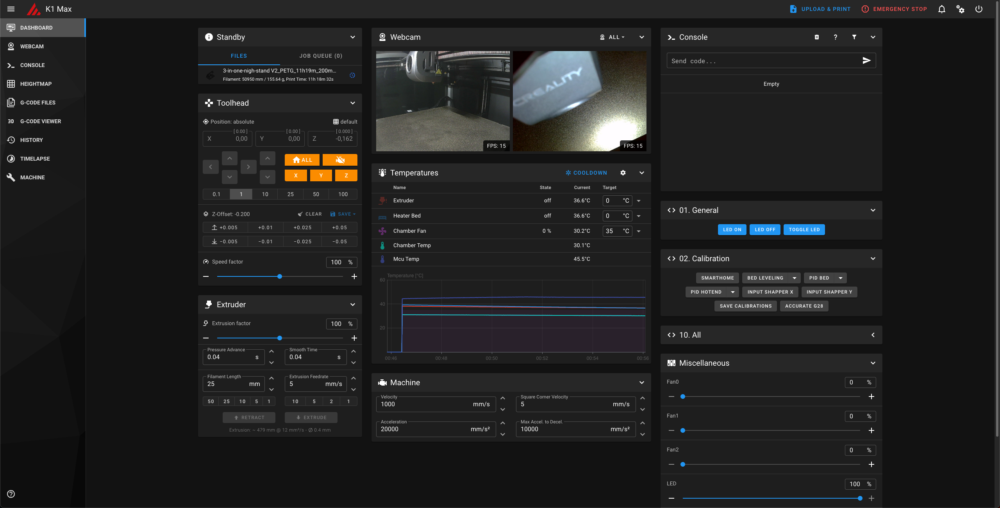
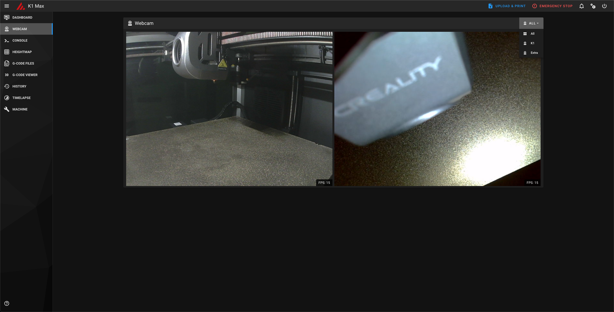

# Creality K1 Max - Dual webcams


## Install

```sh
(cd ~/ && git clone https://gitlab.com/kirbo/k1-max-dual-camera.git && cd k1-max-dual-camera && ./install.sh)
```

## Update

```sh
(cd ~/k1-max-dual-camera && git pull && ./install.sh)
```

## Accessing the cameras

The URL for the cameras:
- Original K1 Max camera stream: [http://ip.to.your.printer:8080/?action=stream_0](http://ip.to.your.printer:8080/?action=stream_0)
- Original K1 Max camera snapshot: [http://ip.to.your.printer:8080/?action=snapshot_0](http://ip.to.your.printer:8080/?action=snapshot_0)
- Additional camera stream: [http://ip.to.your.printer:8080/?action=stream_1](http://ip.to.your.printer:8080/?action=stream_1)
- Additional camera snapshot: [http://ip.to.your.printer:8080/?action=snapshot_1](http://ip.to.your.printer:8080/?action=snapshot_1)

## Screenshots



