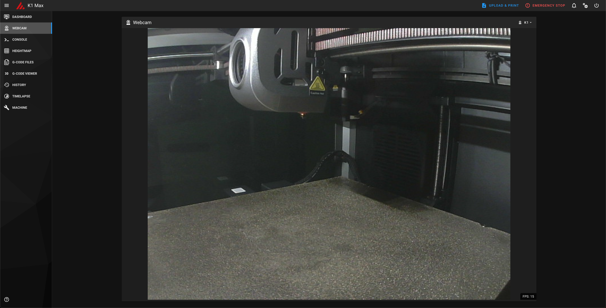
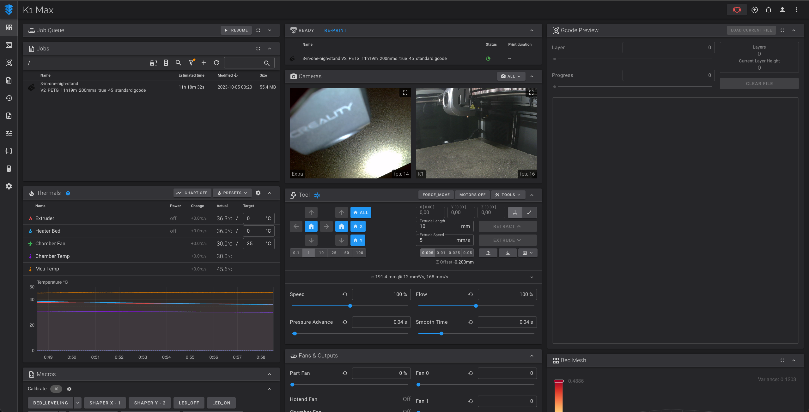
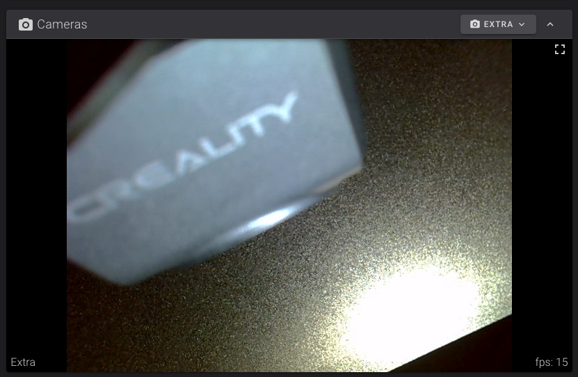

# Discontinued!
Please use this instead: https://github.com/trevos3d/K1-USB-Cam

I've personally shifted on using Raspberry Pi 4 + Logitech C922 webcam, instead of using the K1 Max front USB for webcams, as I noticed it couldn't perform well enough, at least with high resolution or fps.
In case you're interested, please check following Raspi repositories (either GitLab or GitHub):
- https://gitlab.com/kirbo/raspberry-pi-mpjg-streamer
- https://github.com/Kirbo/raspberry-pi-mpjg-streamer


# Creality K1 Max - Dual webcams

## Install

```sh
(cd ~/ && git clone https://gitlab.com/kirbo/k1-max-dual-camera.git && cd k1-max-dual-camera && ./install.sh)
```

## Update

```sh
(cd ~/k1-max-dual-camera && git pull && ./install.sh)
```

## Uninstall

```sh
(cd ~/k1-max-dual-camera && git pull && ./uninstall.sh)
```

## Accessing the cameras

The URL for the cameras:
- Original K1 Max camera stream: [http://ip.to.your.printer:8080/?action=stream](http://ip.to.your.printer:8080/?action=stream)
- Original K1 Max camera snapshot: [http://ip.to.your.printer:8080/?action=snapshot](http://ip.to.your.printer:8080/?action=snapshot)
- Additional camera stream: [http://ip.to.your.printer:8080/?action=stream_1](http://ip.to.your.printer:8080/?action=stream_1)
- Additional camera snapshot: [http://ip.to.your.printer:8080/?action=snapshot_1](http://ip.to.your.printer:8080/?action=snapshot_1)

## Screenshots

### Mainsail




### Fluidd




## Thanks

This repository was heavily inspired by this Reddit thread: https://www.reddit.com/r/crealityk1/comments/15e1ks9/comment/k3lhw7m/?context=3
